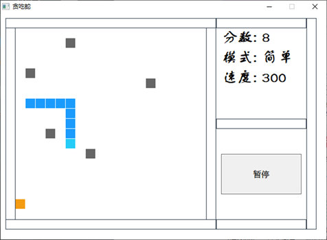

# GreedySnake

[](https://github.com/Razirp) [](https://github.com/Razirp/GreedySnake/blob/main/LICENSE) [](https://www.masm32.com/download.htm)  [](https://github.com/Razirp/GreedySnake/releases) [](https://blog.csdn.net/qq_45899276/article/details/138086800?csdn_share_tail=%7B%22type%22%3A%22blog%22%2C%22rType%22%3A%22article%22%2C%22rId%22%3A%22138086800%22%2C%22source%22%3A%22qq_45899276%22%7D)  [](https://github.com/Razirp/GreedySnake/stargazers)

> 一个MASM 32汇编编写的简单的贪吃蛇游戏。
>
> A simple snake game written in MASM 32 assembly.
>
> This project does not provide an English version now. XD




## 安装指南

### 配置 MASM 32 SDK

本项目基于[此版本](https://www.masm32.com/download.htm)的 MASM 32 SDK，可能暂不兼容最新的 MASM 汇编工具。

#### 下载

在以下链接下载 MASM 32 SDK 的 `installer`：

```
https://www.masm32.com/download.htm
```

安装并配置好环境变量。

配置环境变量可参考[这个链接](https://www.cnblogs.com/lsdb/p/7402955.html)。

#### 汇编

采用 `ml` 工具对 `snake.asm` 进行汇编：

```shell
ml /c /coff ./snake.asm
```

> 在有些情况下，可能会报错“找不到 `.inc` 文件”之类的，说明 `include` 路径环境变量设置可能有问题；此时可以在上述命令中加一条 `/I <include path>` （这里的 `<include path>` 替换为你的 `masm32` 下的 `include` 路径）手动设置 `include` 路径。具体可参考以下 `options` 说明。

<details><summary><code>ml</code> 工具的 <code>options</code>：</summary>

<pre><code>
Microsoft (R) Macro Assembler Version 6.14.8444
Copyright (C) Microsoft Corp 1981-1997.  All rights reserved.


        ML [ /options ] filelist [ /link linkoptions ]

/AT Enable tiny model (.COM file)         /nologo Suppress copyright message
/Bl<linker> Use alternate linker          /Sa Maximize source listing
/c Assemble without linking               /Sc Generate timings in listing
/Cp Preserve case of user identifiers     /Sf Generate first pass listing
/Cu Map all identifiers to upper case     /Sl<width> Set line width
/Cx Preserve case in publics, externs     /Sn Suppress symbol-table listing
/coff generate COFF format object file    /Sp<length> Set page length
/D<name>[=text] Define text macro         /Ss<string> Set subtitle
/EP Output preprocessed listing to stdout /St<string> Set title
/F <hex> Set stack size (bytes)           /Sx List false conditionals
/Fe<file> Name executable                 /Ta<file> Assemble non-.ASM file
/Fl[file] Generate listing                /w Same as /W0 /WX
/Fm[file] Generate map                    /WX Treat warnings as errors
/Fo<file> Name object file                /W<number> Set warning level
/FPi Generate 80x87 emulator encoding     /X Ignore INCLUDE environment path
/Fr[file] Generate limited browser info   /Zd Add line number debug info
/FR[file] Generate full browser info      /Zf Make all symbols public
/G<c|d|z> Use Pascal, C, or Stdcall calls /Zi Add symbolic debug info
/H<number> Set max external name length   /Zm Enable MASM 5.10 compatibility
/I<name> Add include path                 /Zp[n] Set structure alignment
/link <linker options and libraries>      /Zs Perform syntax check only
</code></pre>
        
</details>

### 链接

采用 `link` 工具将生成的 `.obj` 文件链接成可执行程序：

```shell
link /subsystem:windows ./snake.obj 
```

> 在有些情况下，可能会报错“找不到 `.lib` 文件”之类的，说明 `lib` 路径环境变量设置可能有问题；此时可以在上述命令中加一条 `/libpath:<include path>` （这里的 `<include path>` 替换为你的 `masm32` 下的 `lib` 路径）手动设置 `lib` 路径。具体可参考以下 `options` 说明。

<details><summary><code>link</code> 工具的 <code>options</code>：</summary>

<pre><code>
Microsoft (R) Incremental Linker Version 5.12.8078
Copyright (C) Microsoft Corp 1992-1998. All rights reserved.

usage: LINK [options] [files] [@commandfile]

   options:

      /ALIGN:#
      /BASE:{address|@filename,key}
      /COMMENT:comment
      /DEBUG
      /DEBUGTYPE:{CV|COFF}
      /DEF:filename
      /DEFAULTLIB:library
      /DLL
      /DRIVER[:{UPONLY|WDM}]
      /ENTRY:symbol
      /EXETYPE:DYNAMIC
      /EXPORT:symbol
      /FIXED[:NO]
      /FORCE[:{MULTIPLE|UNRESOLVED}]
      /GPSIZE:#
      /HEAP:reserve[,commit]
      /IMPLIB:filename
      /INCLUDE:symbol
      /INCREMENTAL:{YES|NO}
      /LARGEADDRESSAWARE[:NO]
      /LIBPATH:dir
      /MACHINE:{ALPHA|ARM|IX86|MIPS|MIPS16|MIPSR41XX|PPC|SH3|SH4}
      /MAP[:filename]
      /MAPINFO:{EXPORTS|FIXUPS|LINES}
      /MERGE:from=to
      /NODEFAULTLIB[:library]
      /NOENTRY
      /NOLOGO
      /OPT:{ICF[,iterations]|NOICF|NOREF|NOWIN98|REF|WIN98}
      /ORDER:@filename
      /OUT:filename
      /PDB:{filename|NONE}
      /PDBTYPE:{CON[SOLIDATE]|SEPT[YPES]}
      /PROFILE
      /RELEASE
      /SECTION:name,[E][R][W][S][D][K][L][P][X]
      /STACK:reserve[,commit]
      /STUB:filename
      /SUBSYSTEM:{NATIVE|WINDOWS|CONSOLE|WINDOWSCE|POSIX}[,#[.##]]
      /SWAPRUN:{CD|NET}
      /VERBOSE[:LIB]
      /VERSION:#[.#]
      /VXD
      /WARN[:warninglevel]
      /WINDOWSCE:{CONVERT|EMULATION}
      /WS:AGGRESSIVE
</code></pre>
        
</details>

## 设计思路

### 1. 行动逻辑

贪吃蛇的逻辑功能实现主要包括三大块：贪吃蛇下一步的方向；贪吃蛇下一步是否碰到边界？是否碰到障碍物？以及相应的处理；贪吃蛇的运动更新，包含普通的移动更新以及吃到果子之后的更新。

#### 1.1 贪吃蛇下一步的方向

1. 对贪吃蛇下一步方向判断的实现放在了updatePostion函数中。
2. 贪吃蛇自身位置信息都存储在dwX和dwY数组中，贪吃蛇当前的方向存储在dwDirection变量中（0表示停止，1表示向上，2表示向下，3表示向左，4标志向右），而蛇下一步要到达的位置将会存储在dwXTemp和dwYTemp两个临时变量中，在判断开始前，将当前蛇头的位置X、Y存入dwXTemp和dwYTemp。
3. 贪吃蛇下一步的位置将通过当前的方向dwDirection进行判断。例如当dwDirection为1时，表示贪吃蛇将向上移动，而此时坐标系的原点位于整个窗口的左上方，因此对于贪吃蛇的下一步位置，dwYTemp将要减去一个步长；当dwDirection为3时，贪吃蛇将向左移动，因此贪吃蛇下一步位置的横坐标dwXTemp将要减去一个步长。其他的两种情况与之类似，这样就实现了贪吃蛇下一步位置的确认。

#### 1.2 贪吃蛇游戏各种结束情况的判断

贪吃蛇的下一步运动可能会遇到以下三种情况：

1. 贪吃蛇的下一步运动碰上了边界
2. 贪吃蛇的下一步运动碰到了自身某部位
3. 贪吃蛇的下一步运动碰到了障碍物

对①、②状态可以一起进行判断。当贪吃蛇处于运动状态，即direction不为0时，将储存蛇位置的数组dwX和dwY中的每一个值取出，与蛇的下一步位置dwXTemp和dwYTemp进行比较，如果都相等，说明贪吃蛇碰到了自身，需要关停计时器，将标志设为重玩模式，将运动标志dwDirection设为0，同时弹出对话框提醒玩家游戏结束。或者当蛇的下一步位置dwXTemp和dwYTemp超出了整个游戏的边界范围，也需要关停计时器、弹出对话框提醒结束游戏等一系列操作。

对③的情况，在游戏建立初期，便根据需要的障碍物数量，随机生成了5-10个障碍物，将其随机摆放在游戏地图中，障碍物的位置信息储存在barrierX和barrierY数组中。因此，对于贪吃蛇是否碰到障碍物的判断，需要将贪吃蛇下一步位置dwXTemp和dwYTemp，与每一个障碍物位置X，Y进行比较，如果相等说明贪吃蛇撞到了障碍物，需要关停计时器，将标志设为重玩模式，将运动标志dwDirection设为0，同时弹出对话框提醒玩家游戏结束。

#### 1.3 贪吃蛇的运行更新

贪吃蛇中果子的坐标，存储在dwNextX和dwNextY中，判断贪吃蛇是否吃到了果子，就要将贪吃蛇的下一步位置dwXTemp和dwYTemp与果子的坐标X、Y进行比较，如果相同，则将果子的坐标加入贪吃蛇位置数组dwX和dwY中，同时贪吃蛇的长度加一。

之后需要重新生成果子的坐标，此时就可能遇到随机生成的果子坐标与蛇的位置重合，或者与障碍物的位置重合这两种情况。对于这两种情况，则需要重新生成果子的坐标，直到坐标与蛇的位置和障碍物位置都不重合为止。

最后一种情况则是最正常的情况，贪吃蛇没有碰到任何物体，正常前进。这个时候则需要将贪吃蛇的下一步位置dwXTemp和dwYTemp正式加入贪吃蛇自身的位置数组dwX和dwY中，将自身每一点的位置移动到数组下一位置处，整体看来就是贪吃蛇向前移动了一个，同时更新贪吃蛇打印身体所需的数组坐标dwXT和dwYT，至此，贪吃蛇的逻辑基本实现了。

#### 1.4 贪吃蛇的速度

贪吃蛇的速度根据所选的游戏模式而定。共有入门、简单、进阶、困难四种模式。变量dwModuleflag用于标注选择的模式，上述四种模式对应的值分别为0、1、2、3。

贪吃蛇的速度控制通过控制计时器的刷新间隔实现。刷新间隔越短，游戏画面刷新得越快，贪吃蛇的移动速度就越快；反之，刷新间隔越长，游戏画面刷新得越慢，贪吃蛇的移动速度就越慢。

在入门难度下，计时器的刷新间隔将被设置为500，这是一个较慢的速度，方便入门玩家熟悉游戏操作。

在简单模式下，计时器的刷新间隔将被设置为300，这是一个适中的速度，适合一般的玩家。

在进阶模式下，计时器的刷新间隔将随着贪吃蛇身体的增长而减小，使得贪吃蛇的移动速度越来越快，以实现一个递增的游戏难度。在这一模式下，每次刷新时计算蛇身长度，以300为初始刷新间隔，在此基础上每增加1长度，刷新间隔减少10，当刷新间隔到达100时，将停止减少，防止游戏速度变得过快。

在困难模式下，计时器的刷新间隔将被设置为100，即进阶模式下的最快速度。这是一个较快的速度，适合熟悉游戏并希望游戏具有一定挑战性的玩家。

### 2. 界面交互逻辑

#### 2.1 开始界面

游戏开始时先进入到一个初始菜单界面，在初始菜单里可以进行开始新游戏、进入设置难度模式界面、查看帮助和关于文档等操作。游戏暂停时也将返回到这一界面，但会多出一个“继续”按钮以点击使游戏继续进行。


#### 2.2 选择模式界面

在点击了开始界面的“选择模式”按钮之后，游戏会跳转到“选择模式”界面，在这里可以进行游戏难度模式的选择。


#### 2.3 帮助与关于界面

在点击了开始界面的“帮助”或“关于”按钮之后，会调用MessageBox API以弹出一个提示窗口，显示相应的文档内容。


#### 2.4 游戏界面

在开始游戏后会进入游戏界面，其左侧会显示贪吃蛇的游戏地图（蓝色为蛇，橙色为食物），右侧将显示当前的分数、模式、速度等信息。同时，右下方有一个“暂停”按钮，点击它将返回开始界面。


#### 2.5 多界面设计的实现

在Win32程序的一个窗口中实现多个界面的设计是比较困难的，网络上也少有相关的实现。在经过一番思考后，我们决定通过在切换界面时隐藏上一个界面的控件并且显示下一个界面的控件解决了这个问题。

## 许可证

本项目采用MIT许可协议 – 详情请参阅 [LICENSE](LICENSE) 文件。

## 联系方式

如有任何问题或咨询，请通过 razirp77@outlook.com 与我联系。